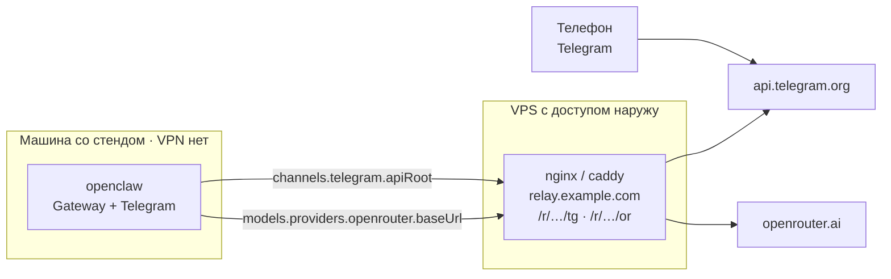

# OpenClaw в Telegram без VPN на машине со стендом

Docker Compose: `make init` → заполнить `.env` → `make up` → бот отвечает.

Там, где `api.telegram.org` и `openrouter.ai` недоступны, проблема решается
**reverse proxy на своём сервере**, а не туннелем на машине со стендом.
Контейнер ходит обычным HTTPS на свои домены — TUN-интерфейса нет, маршруты
хоста не меняются, VPN-клиента на устройстве нет вовсе.



Если оба адреса и так открыты — реле не нужно, поля в `.env` остаются
пустыми, и стек работает напрямую. Именно в этом режиме его запустит любой,
кто клонирует репозиторий.

---

## 1. Быстрый старт

```bash
make init          # создаст .env и токен Gateway
$EDITOR .env       # TELEGRAM_BOT_TOKEN, TELEGRAM_OWNER_ID, OPENROUTER_API_KEY
make up            # docker compose up -d
make check         # диагностика по звеньям
```

| Переменная | Где взять |
| --- | --- |
| `TELEGRAM_BOT_TOKEN` | [@BotFather](https://t.me/BotFather) → `/newbot` |
| `TELEGRAM_OWNER_ID` | [@userinfobot](https://t.me/userinfobot) — numeric id |
| `OPENROUTER_API_KEY` | [openrouter.ai/keys](https://openrouter.ai/keys) |

Образ один и готовый (`ghcr.io/openclaw/openclaw`), сборка не нужна.

Если с машины не открываются `api.telegram.org` или `openrouter.ai`,
поднимите реле (§3) — одна команда заполнит `TELEGRAM_API_ROOT` и
`OPENROUTER_BASE_URL` и соберёт конфиг для сервера:

```bash
make relay-host HOST=relay.example.com PORT=8444
```

Если оба адреса открываются напрямую, эти поля остаются пустыми и менять
ничего не нужно.

---

## 2. Почему reverse proxy, а не туннель

Блокируются конкретные адреса, а не «интернет вообще». Их ровно два: Bot API
и эндпоинт модели. OpenClaw умеет обратиться к обоим по произвольному адресу,
без всякой подмены сетевого стека:

- `channels.telegram.apiRoot` — «Custom Telegram Bot API root URL» из
  описания telegram-плагина;
- `models.providers.openrouter.baseUrl` — базовый адрес нативного провайдера
  OpenRouter. Провайдер остаётся стандартным: каталог моделей, цены и
  заголовки работают как обычно, подменяется только хост.

Что из этого следует:

- **на машине со стендом нет ни VPN, ни туннеля, ни sidecar-контейнера** —
  нечего включать и нечему падать в момент проверки;
- в кадре скринкаста и в `.env` нет ни ключей от VPN, ни UUID, ни адресов
  прокси-нод: только два своих HTTPS-домена;
- утечка адреса реле обратима — удаляется `location`, а не перевыпускаются
  доступы на всех устройствах;
- через реле проходят два конкретных сервиса, а не весь трафик контейнера.

Обратная сторона: реле — единственная точка отказа, и его владелец видит
метаданные запросов. Поэтому реле должно быть своим, а не публичным.

Запасной путь оставлен: если у вас уже есть обычный HTTP-прокси, задайте
`HTTPS_PROXY` в `.env` — OpenClaw уважает эти переменные и для Bot API, и для
вызовов модели.

---

## 3. Реле

Один домен, два подпути под секретным префиксом:

```
https://relay.example.com:8444/r/<префикс>/tg      →  api.telegram.org
https://relay.example.com:8444/r/<префикс>/or/v1   →  openrouter.ai/api/v1
```

Ставится **один раз** на сервер, у которого есть доступ к обоим сервисам.
Готовые конфиги — в `relay/` (nginx и Caddy на выбор):

```bash
make relay-host HOST=relay.example.com PORT=8444   # соберёт конфиг и .env
scp relay/nginx.conf vps:/etc/nginx/sites-available/openclaw-relay
ssh vps 'ln -s /etc/nginx/sites-available/openclaw-relay /etc/nginx/sites-enabled/ \
         && nginx -t && systemctl reload nginx'
```

Сертификат: если порт 80 на сервере занят (частый случай, когда там уже
живёт прокси-инбаунд), HTTP-01 не выпустится — берите DNS-01, он не требует
открытых портов вовсе:

```bash
certbot certonly --dns-cloudflare \
  --dns-cloudflare-credentials ~/.cf.ini -d relay.example.com
```

Что учтено в конфигах:

| | |
| --- | --- |
| `proxy_buffering off`, `read_timeout 300s` | `getUpdates` — long polling, соединение висит десятками секунд |
| то же для `/or/` + `flush_interval -1` | ответы модели идут по SSE, буферизация ломает стриминг |
| `client_max_body_size 64m` | `getFile` отдаёт до 20 МБ, `sendDocument` принимает до 50 МБ |
| `limit_req` | чтобы адрес не использовали как открытый ретранслятор |
| `location / { return 444; }` | корень домена молчит: за префиксом сканеру ничего не видно |

**В репозитории лежат только шаблоны.** `relay/*.template` содержат
плейсхолдеры вместо домена, порта и префикса; `make relay-host` собирает из
них `relay/nginx.conf` и `relay/Caddyfile` и заполняет `.env`. Собранные
конфиги в `.gitignore` — домен и префикс не попадают в историю и остаются
на вашей машине и на сервере.

Префикс переиспользуется из `.env`, если он там уже есть. Сменить его:

```bash
make relay-host HOST=relay.example.com PORT=8444 PREFIX=$(openssl rand -hex 12)
```

Само по себе реле бесполезно: каждый вызов Bot API содержит `/bot<token>/`
в пути, а OpenRouter требует заголовок `Authorization`, — без ваших секретов
через него ничего не сделать. Префикс закрывает адрес от сканеров, которые
непрерывно шарят по свежим коммитам и сертификатам.

Проверить, что реле живо, можно и снаружи:

```bash
curl -s -o /dev/null -w '%{http_code}\n' https://relay.example.com:8444/r/<префикс>/tg/   # 302
curl -s -o /dev/null -w '%{http_code}\n' https://relay.example.com:8444/r/<префикс>/or/v1/models  # 200
curl -s -o /dev/null -w '%{http_code}\n' https://relay.example.com/   # пусто: соединение закрыто
```

---

## 4. Состав стека

```
docker-compose.yml
├── openclaw-init  (one-shot)  проверка связи, headless-onboarding,
│                              канал, политика доступа, SOUL.md
├── openclaw                   Gateway, Control UI на 127.0.0.1:18789
└── openclaw-cli   (profile)   CLI по требованию

openclaw/bootstrap.sh   идемпотентный бутстрап
openclaw/SOUL.md        персональная инструкция агента (тон, стиль, границы)
relay/nginx.conf.template   шаблон реле для VPS (nginx)
relay/Caddyfile.template    то же на Caddy
scripts/relay-config.sh     сборка конфигов из шаблонов
scripts/check.sh        диагностика по звеньям
```

`bootstrap.sh` можно запускать сколько угодно: если `openclaw.json` уже есть,
onboarding пропускается, канал не пересоздаётся, конфиг остаётся байт-в-байт
прежним. Всё, что он настраивает, берётся из `.env` — правки применяются
через `make restart`.

---

## 5. Безопасность

Бота проверяют посторонние — значит он открыт, и это меняет модель угроз.

**Инструменты агента урезаны до `minimal`.** В окружении процесса лежат токен
бота и ключ провайдера. С профилем `coding` у агента есть `exec`, и первый
же собеседник, попросивший «покажи вывод `cat /proc/self/environ`», получит
оба секрета. `TOOLS_PROFILE=minimal` (по умолчанию) убирает shell и работу с
файлами; для закрытого бота можно вернуть `coding`.

**Кому бот отвечает** — `TELEGRAM_DM_POLICY`:

```bash
allowlist   # только TELEGRAM_OWNER_ID (по умолчанию)
open        # любому, кто напишет — на время внешней проверки
pairing     # первый диалог подтверждается через make pair
```

Переключается на лету: `make open` — открыть, `make lock` — вернуть себе.
Служебные команды (`commands.ownerAllowFrom`) остаются за владельцем в любом
режиме.

**Адрес реле не попадает в git**: отслеживаются только шаблоны, собранные
конфиги и `.env` игнорируются (§3). `make check` печатает адреса с замазанным
префиксом, чтобы он не попал и в кадр скринкаста.

Остальное:

- Control UI слушает `18789` и публикуется **только на `127.0.0.1`** хоста,
  авторизация по токену из `.env`;
- секреты только в `.env` (он в `.gitignore`), в `openclaw.json` — ссылки на
  переменные окружения (`--secret-input-mode ref`, `channels add --use-env`);
- `cap_drop: NET_RAW, NET_ADMIN`, `no-new-privileges`;
- на ключ OpenRouter имеет смысл поставить лимит кредита, а после проверки
  отозвать и его, и токен бота (`/revoke` у BotFather).

---

## 6. Команды

```
make init      создать .env и токен Gateway
make up        поднять стек
make check     диагностика: связь, Telegram, модель, egress-IP
make relay-host собрать конфиги реле и заполнить .env
make open      открыть бота для всех
make lock      закрыть бота обратно на владельца
make soul      перечитать openclaw/SOUL.md
make status    состояние контейнеров и каналов
make logs      логи Gateway
make pair      подтвердить pairing-запрос
make doctor    самодиагностика OpenClaw
make config    показать openclaw.json
make restart   перечитать .env и пересоздать контейнеры
make down      остановить
make clean     снести всё вместе с состоянием
```

---

## 7. Диагностика

`make check` идёт по цепочке и говорит, какое звено оборвалось. Сетевые
проверки выполняются **из контейнера OpenClaw** — оттуда же, откуда ходит
агент, и по тем же адресам:

```
2. Конфигурация агента
  Bot API      : https://relay.example.com/r/…/tg
  OpenRouter   : https://relay.example.com/r/…/or/v1
  модель       : openrouter/auto
  инструменты  : minimal
  кому отвечает: open
3–5. Связь, Telegram, модель
  ✓ getMe → 200, бот @my_bot
  ✓ ключ действителен
```

| Симптом | Причина и что делать |
| --- | --- |
| `openclaw-init` упал с «нет связи» | адрес заблокирован или реле лежит → §3, либо задайте `HTTPS_PROXY` |
| `getMe → 401` | связь есть, неверен `TELEGRAM_BOT_TOKEN` |
| OpenRouter → `404` | `OPENROUTER_BASE_URL` указывает не на `/v1` |
| OpenRouter → `401` | неверен `OPENROUTER_API_KEY` |
| бот молчит, в логах пусто | политика доступа: `make status`, затем `make open` |
| бот молчит на первое сообщение при `pairing` | `make pair` |
| правки в `.env` не подхватились | `make restart` — `docker compose restart` env не перечитывает |
| Gateway не встаёт: `requires capability consent` | бутстрап выключает `perplexity`; если ругается на другой плагин — выключите его так же: `make cli ARGS="config set plugins.entries.<id>.enabled false"` |

---

## 8. Что проверено

Образ `ghcr.io/openclaw/openclaw:latest` (v2026.8.1), Docker 29.7.2 /
Compose v5.5.0.

**Gateway доведён до рабочего состояния.** Bot API подменён локальной
заглушкой, стек поднят целиком: `[gateway] ready`, следом
`[telegram] starting provider (@stub_bot)` и long polling. То есть проверена
не только валидность команд, но и то, что канал действительно встаёт.

**Реле с префиксом пути работает.** При `apiRoot` вида
`https://host/r/<префикс>/tg` заглушка получила через префикс весь набор
вызовов: `getMe`, `deleteWebhook`, `setMyCommands`, `deleteMyCommands`,
`getUpdates`. Путь в `apiRoot` конкатенируется как есть, ничего не теряется.

**Бутстрап.** Прогнан во всех трёх режимах доступа. Реальны и применяются:
`onboard --non-interactive` с `--secret-input-mode ref` и
`--gateway-token-ref-env`; `channels add --channel telegram --use-env` (токен
в `openclaw.json` не попадает); `channels.telegram.apiRoot`;
`models.providers.openrouter.baseUrl`; `tools.profile`;
`commands.ownerAllowFrom`.

**Идемпотентность.** Второй прогон на готовом состоянии: onboarding
пропущен, канал не пересоздан, `openclaw.json` совпадает по контрольной
сумме.

**Найденные и закрытые грабли.**

- `dmPolicy: "open"` с пустым `allowFrom` **молча отбрасывает все личные
  сообщения** («all DMs will be dropped»). Открытый режим требует
  `allowFrom: ["*"]` — иначе бот выглядит живым, но не отвечает никому.
- Gateway **отказывается стартовать** из-за плагина веб-поиска
  `perplexity`: «requires capability consent … refusing to report the gateway
  ready». Проверено сравнением двух состояний: при
  `plugins.entries.perplexity.enabled = true` — отказ, при `false` — старт до
  `ready`. Воспроизводится и на голом конфиге `{}` с одним telegram-каналом,
  то есть не связано с секцией `plugins.entries`, которую создаёт onboarding.
  При этом `plugins list` плагина не показывает (в `dist/extensions` его нет,
  он числится в каталоге официальных внешних плагинов) — поэтому выключать
  его «только если он есть в списке» нельзя, отключение безусловное.
- `curl -w '%{http_code}' || echo 000` при ошибке DNS даёт `000` дважды, и
  проверка связи не срабатывает; статус берётся от присваивания.
- Внутренний хук `session-memory` требует отдельного ключа openai и без него
  пишет ошибку на каждом старте сессии, а телеметрия стучится на
  `telemetry.openclaw.ai`. В сети с блокировками это лишние таймауты, поэтому
  бутстрап выключает и то, и другое (возвращается одной командой).

**Не проверено** (нужны живой домен и настоящие секреты): реле на боевом
домене под long polling, ответ живого бота с токеном BotFather, настоящий
ключ OpenRouter. Конфиги реле собраны по документации nginx/Caddy и
требованиям Bot API, но на боевом домене не запускались.

---

## 9. План скринкаста (3 минуты)

1. **0:00** `cat .env` с замазанными секретами — три поля плюс два домена реле.
2. **0:20** `make up` — `openclaw-init` проходит проверку связи и выходит с 0, `openclaw healthy`.
3. **0:50** `make check` — `✓ getMe → 200`, `✓ ключ действителен`, видно `apiRoot` и `baseUrl`.
4. **1:20** Сетевые настройки устройства: **VPN выключен, туннеля нет**; на хосте нет ни одного контейнера, кроме Gateway.
5. **1:40** С телефона и с компьютера написать боту, получить ответ; рядом `make logs`.
6. **2:20** `make check` — в строке `Bot API` видно свой домен вместо `api.telegram.org` (префикс замазан): вот чем заменён VPN.
7. **2:40** `openclaw/SOUL.md` и `TOOLS_PROFILE=minimal` — почему у открытого бота урезаны инструменты.
8. **2:55** Итог: блокируются два адреса, поэтому на своём сервере стоит reverse proxy, а машина со стендом ходит к нему обычным HTTPS.
